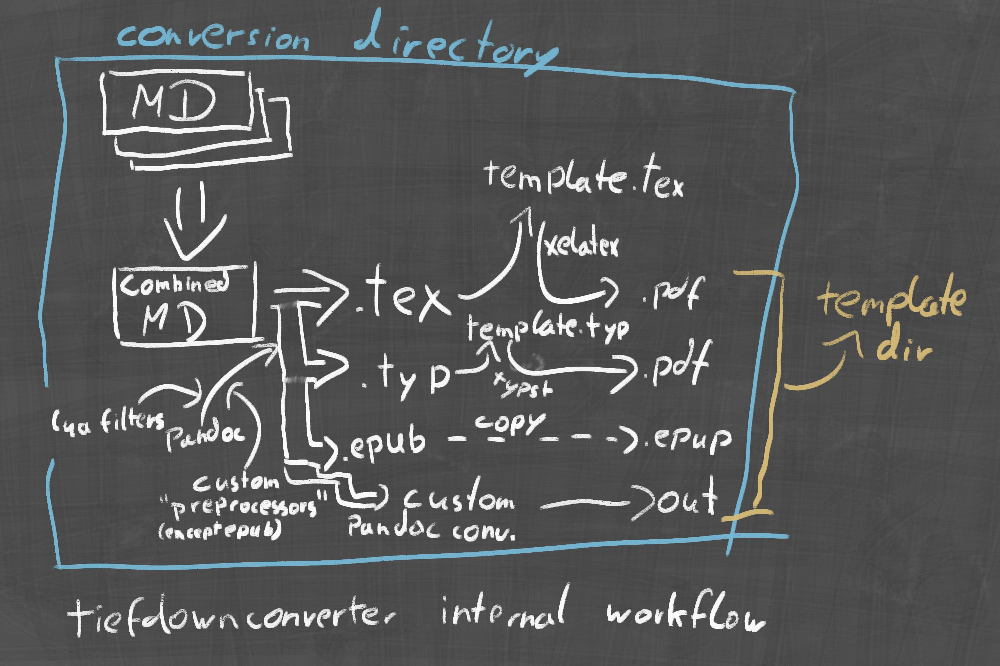

# Conversion Pipeline

The conversion pipeline is relatively complex, but important to understand. It
consists of a few important steps, as outlined in the (slightly out of date)
workflow diagram:

Starting out, a new "compilation directory", more correctly named conversion
directory, is created with the current timestamp. This is a scratch directory
and should not be tracked via the VCS.

Then, the following steps are executed in order:

0) Conversion queue generation: First off, TiefDown takes the available 
   Markdown projects and templates and computes a queue. This queue contains
   the markdown project as well as the templates to be converted. Per default,
   this is computed via the default profiles.

1) Input discovery and ordering: TiefDown copies and scans the markdown project 
   directory, orders files by the first number in the filename (e.g. 
   `Chapter 10 - …`), and recurses into similarly numbered subfolders, 
   preserving their order. [Custom resources](#custom-resources) are not yet 
   copied.

2) Preprocessing by extension: Inputs are grouped by file extension. For each
   group, TiefDown selects the matching [preprocessor](#custom-processors) for 
   the active template (either a default or a custom one filtered by extension) 
   and runs it in the conversion folder. The stdout from each run is captured
   and stored in memory.

3) Combined output: The captured outputs are concatenated and written to the
   template’s configured `preprocessors.combined_output` file (typically
   `output.tex` for LaTeX or `output.typ` for Typst). Your template includes
   this file (e.g. `#include "output.typ"`).

4) Metadata files: TiefDown generates `metadata.tex` or `metadata.typ` (only if
   they don’t already exist) based on `[shared_metadata]`, any project-specific
   metadata, and your optional [metadata settings](#metadata-settings).

5) Template processing: Depending on the template type, TiefDown runs XeLaTeX
   (twice) or Typst on the template file in the conversion folder, optionally
   passing arguments from a named [processor](#custom-processors). EPUB templates
   invoke Pandoc directly. `CustomPreprocessors` templates copy the combined
   output as-is to the final destination. `CustomProcessor` templates run a
   final Pandoc invocation reading the combined Pandoc Native input and passing
   the configured processor arguments.

6) Finalization: The produced artifact (e.g. a PDF or EPUB) is then copied to
   the markdown project’s configured output path.
