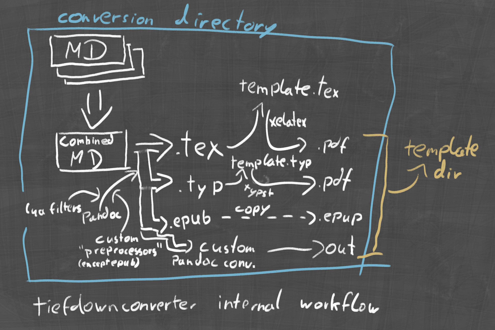

# Conversion folders

The conversion folder is the folder where the template and markdown files are
located during conversion.

Before the conversion process begins, a new folder is created in the project
directory. This is the conversion folder, named after the current date and
time. This folder can be deleted using the `clean` function, or automatically
removed when converting using [smart clean](#smart-clean).

If a [markdown project](#markdown-projects) has an output folder defined, this
is used as the conversion folder for that markdown project.

To explain more thuroughly, we need to explain the workflow of TiefDown
conversion. Helpfully, there's a diagram:

As you can see, the first step of any conversion is combining the markdown
files to a single Markdown file. This is done before conversion, sorting the
files by chapter number. This chapter number is retrieved from the filename.
The file must thus be named `Chapter X.md` where X is the chapter number. This
does not need to include leading zeros. This combined file is then saved as
`combined.md` in the conversion folder.

After combination, pandoc is run on the combined file to derive LaTeX, typst,
epub or custom outputs in case of [custom pandoc conversion](#custom-pandoc-conversion).

For LaTeX and Typst templates, the output file is imported into the template
file as described in the [templates](#templates) section. The conversion
process converts the template file and stores the output in the conversion
folder.

The output file is then copied to the output folder.
